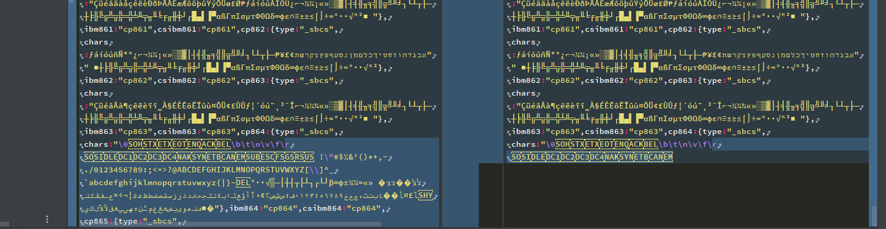

# Ruby bug occurring when reading files at MS Windows
This repository is created to demonstrate a bug in Ruby that occurs on MS Windows when reading files.

## Use case
A javascript file, containing some special characters is not read completely when using `File.read`. Its content is cut at some point.

When writing back the content into another file, you can make a diff an see the missing part.
The part is already missing after reading, to the bug is related to `File.read`.

See and run the script `script.rb` in the root directory of this project by running `ruby script.rb` to reproduce the issue. You need to run on a MS Windows machine on a default terminal (not Linux WSL!).

## Testing Environment
Tried Ruby 2.4.10, 2.7.2 and latest  Ruby+Devkit 3.1.2-1 (x64) on MS Windows 10 (mingwx64 builds) using installers from rubyinstaller.org.

Problem only occurs on MS Windows. Didn't happen on Linux or Linux Subsystem for Windows (WSL).
